# Text Feature Engineering Report

## 1. Executive Summary
This is the first assignmentfrom Krish Naik's Modern Route - Full Stack GenerativeAI and AgenticAI bootcamp.  This assignment comes directly after the first module of the course, investigating the fundamentals of text encoding, embedding and tokenisation (the foundations of modern GenAI with transformer functions).  This report documents an end-to-end text feature engineering workflow on real-world Amazon review data. The goal was to transform review text into machine-learning-ready numerical features and compare three classical representations: One Hot Encoding (OHE), Bag of Words (BoW), and TF-IDF. The analysis shows that TF-IDF provides the strongest balance of informativeness and model performance for this dataset. In the final sentiment classification mini use case, TF-IDF with Logistic Regression outperformed BoW across Accuracy and F1 metrics.

## 2. Problem Statement
A practical text processing pipeline was required to:
1. Collect real-world review text data.
2. Preprocess and normalize text.
3. Create numerical text representations (OHE, BoW, TF-IDF).
4. Compare methods analytically and empirically.
5. Evaluate a downstream sentiment classification task.

## 3. Dataset Source and Scope
- Source used: [Kaggle Amazon reviews dataset](https://www.kaggle.com/code/jalesummak/amazon-reviews-topic-modeling-with-nlp-nmf-lda).
- File used in this assignment: 7817_1.csv.
- Main text field: reviews.text.
- Label field for mini use case: reviews.rating.

### Data Collection Note
Initial web scraping attempts (BeautifulSoup/Selenium) encountered bot protection constraints. To keep focus on feature engineering objectives and classroom scope, a public real-world dataset was used.

## 4. Preprocessing Pipeline (Task 1)
The notebook applies a standard preprocessing sequence:
1. Load reviews from CSV.
2. Convert text to lowercase.
3. Remove punctuation.
4. Tokenize into words.
5. Remove English stopwords.
6. Lemmatize tokens (WordNet).

### Screenshots of preprocessing
Words converted to lowercase, punctuation removed and tokenised
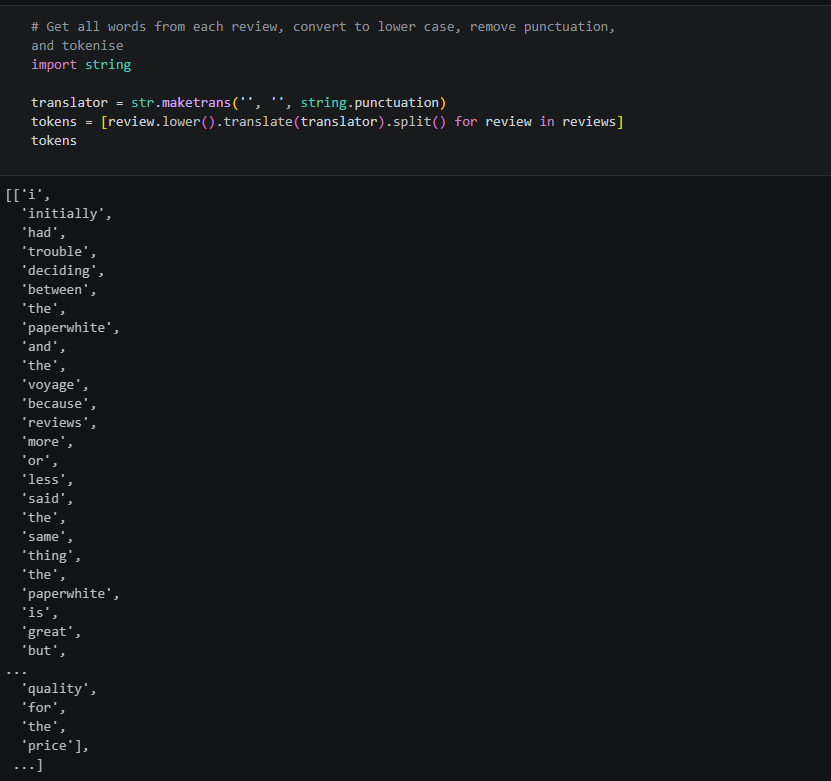{width=500}
Removed English Stopwords
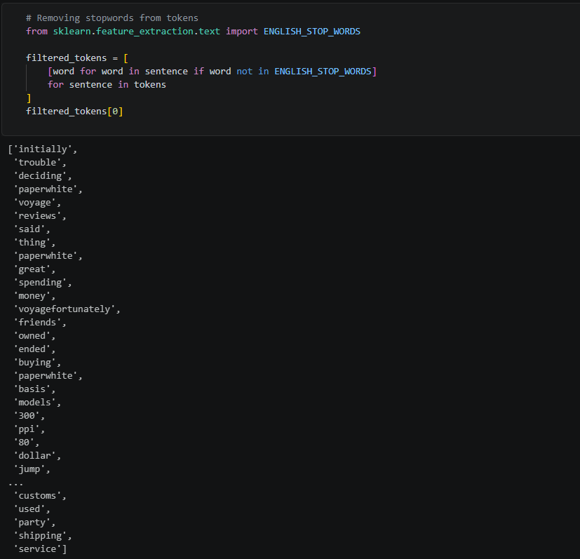{width=500}
Lemmatisation of Tokens
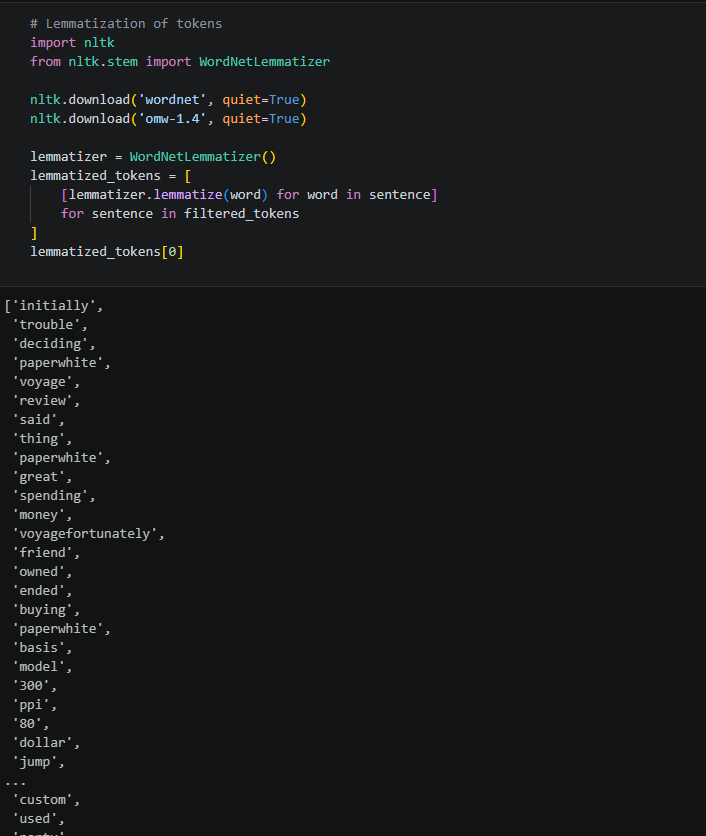{width=500}

This pipeline reduces noise, normalizes lexical variants, and improves feature quality.

## 4.5. Vocabulary Creation using SKLearn
- Created a vocabulary of unique words taken from the Amazon reviews using the OneHotEncoder function using the lemmatised tokens.

Retrieving all words
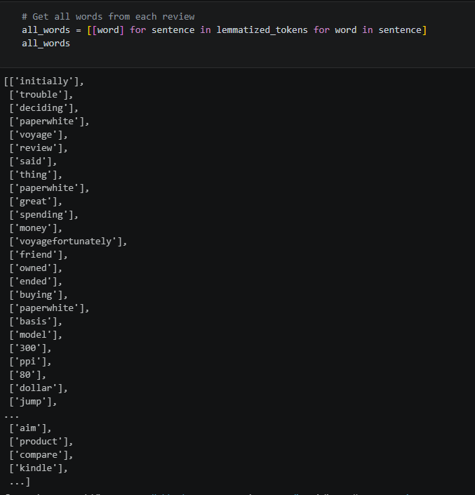{width=500}
Creating vocabulary
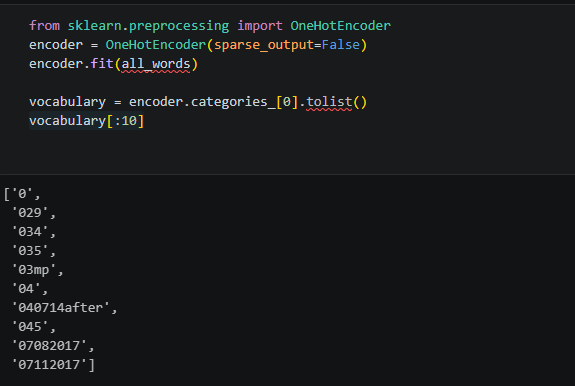{width=500}

## 5. Feature Engineering Methods (Task 3)
### 5.1 One Hot Encoding (OHE)
- Represents whether each vocabulary term appears in a document.
- Value type: binary (0/1).
- Advantage: simple and interpretable.
- Limitation: ignores frequency and global importance.
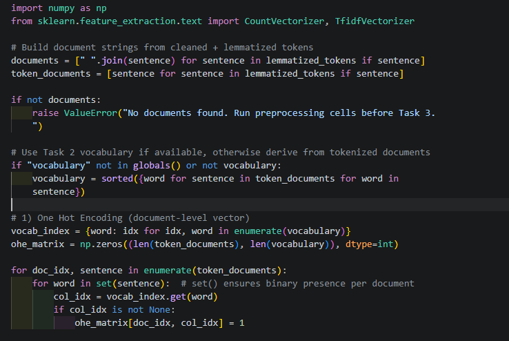{width=500}
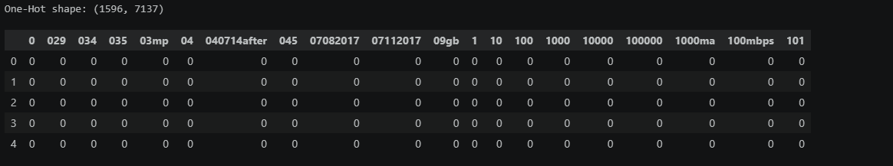{width=500}

### 5.2 Bag of Words (BoW)
- Counts occurrences of terms within each document.
- Value type: integer counts.
- Advantage: captures within-document frequency.
- Limitation: frequent common words can dominate.
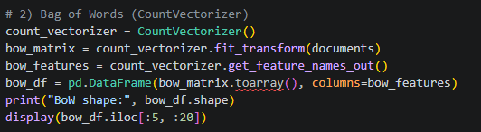{width=500}
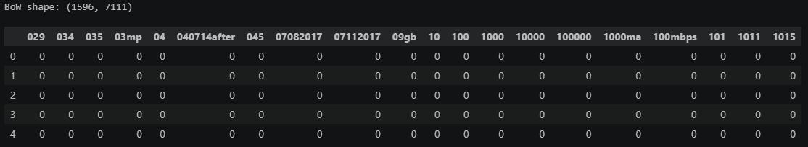{width=500}

### 5.3 TF-IDF
- Weights each term by local frequency and global rarity.
- Value type: weighted real values.
- Advantage: highlights discriminative terms.
- Limitation: less intuitive than raw counts.
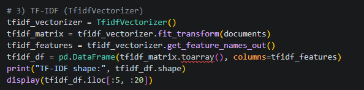{width=500}
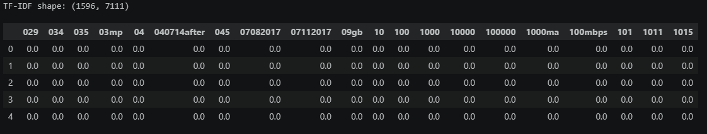{width=500}

### 5.4 Check for non-zero terms for all feature engineering methods
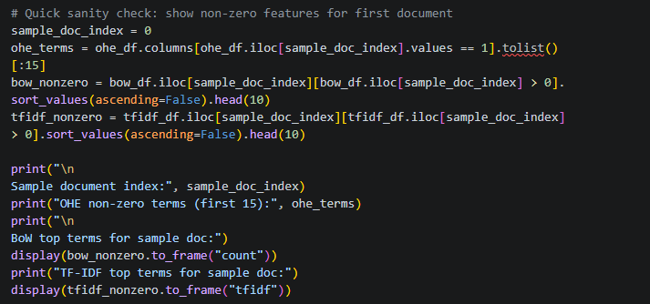{width=500}
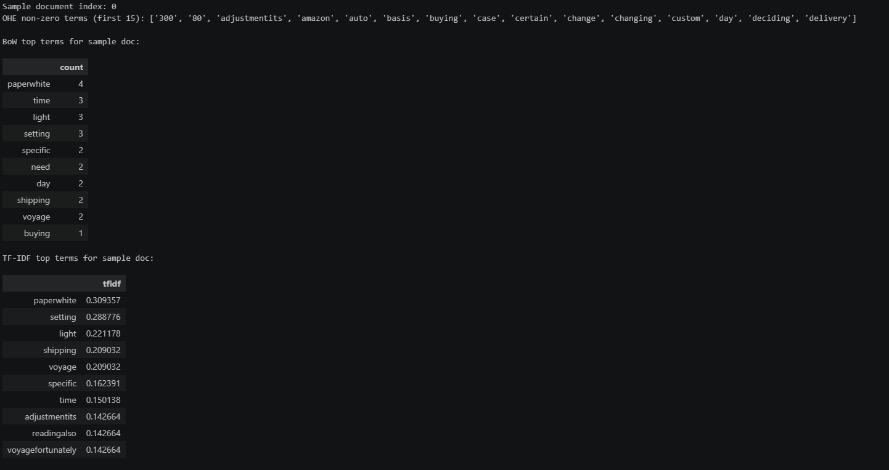{width=500}

## 6. Comparison Analysis (Task 4)
| Method | Vector Values | Uses Frequency | Considers Cross-Document Importance | Typical Sparsity | Best Use |
|---|---|---|---|---|---|
| OHE | Binary (0/1) | No | No | Very High | Presence detection |
| BoW | Integer counts | Yes | No | High | Frequency-based baseline |
| TF-IDF | Weighted real values | Yes (TF) | Yes (IDF) | High | Informative term weighting |

### Why Common Words Receive Lower TF-IDF Weight
TF-IDF combines term frequency with inverse document frequency:

TF-IDF(t, d) = TF(t, d) x IDF(t)

A term that appears in many documents has high document frequency, resulting in lower IDF. Therefore, globally common words receive lower final TF-IDF weight.

### Notebook screenshots
Comparison table
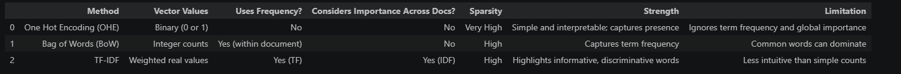{width=500}
TF-IDF Most important words
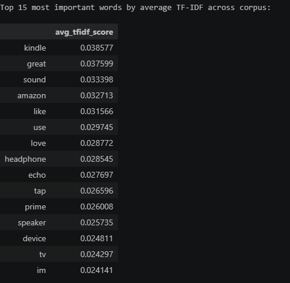{width=500}
TF-IDF Most common words across documents.
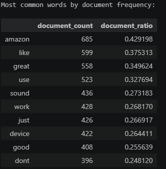{width=500}

## 7. Sparse Matrix Analysis (Task 5)
All three text representations produce high-dimensional sparse matrices. This has practical implications:
1. Memory inefficiency if stored densely.
2. Extra compute spent on zeros.
3. Larger bandwidth pressure in distributed systems.
4. Scaling challenges as vocabulary size grows.

Operationally, sparse storage formats and feature selection are important for production-scale NLP pipelines.

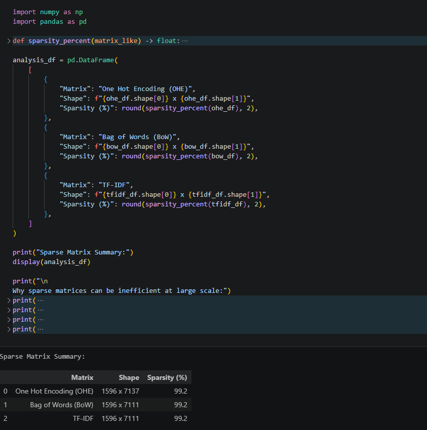{width=500}

## 8. Real-World Limitation Demonstration (Task 6)
A small semantic similarity test showed that BoW and TF-IDF can miss synonym-level meaning when exact lexical overlap is low (for example, "movie" vs "film"). This motivates embeddings for deeper semantic tasks.

Semantic similarity output
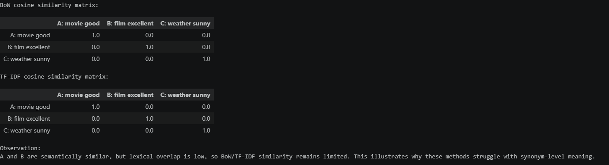{width=500}

## 9. Mini Use Case: Sentiment Classification (Task 7)
Two pipelines were trained and compared:
1. BoW + Logistic Regression (class_weight="balanced").
2. TF-IDF + Logistic Regression (class_weight="balanced").

### Reported Performance (from notebook run)
| Model | Accuracy | F1 (Positive) | F1 (Macro) |
|---|---:|---:|---:|
| BoW + Logistic Regression | 0.9336 | 0.9648 | 0.6907 |
| TF-IDF + Logistic Regression | 0.9479 | 0.9719 | 0.8085 |

### Notebook screenshots
Sentiment classification code.
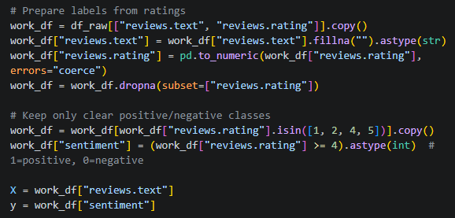{width=500}
Encoding technique + Linear regression code.
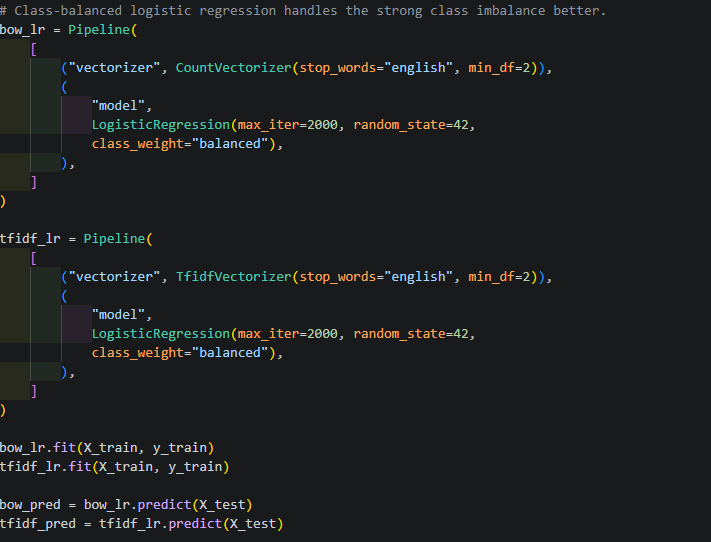{width=500}
Results printing code.
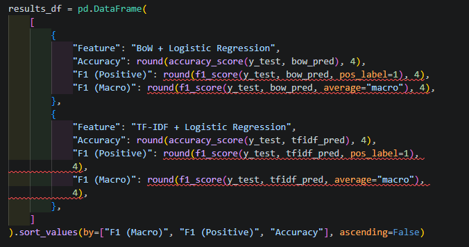{width=500}
Task output
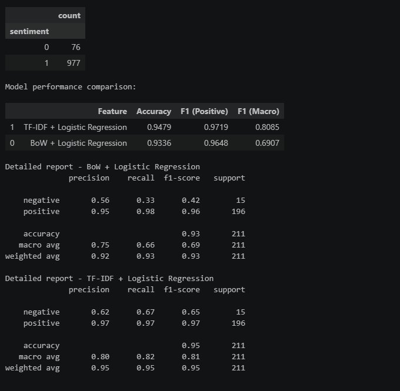{width=500}

## 10. Final Recommendation
For this assignment dataset and setup, TF-IDF + Logistic Regression is the recommended baseline model.

### Rationale
1. Strongest overall metric performance.
2. Better macro-level balance across classes.
3. Good interpretability and efficiency for sparse text features.

## 11. Risks and Limitations
1. Ratings-derived sentiment labels may contain noise.
2. Class imbalance can still affect minority-class behavior.
3. Vocabulary-based methods have limited semantic understanding.
4. Results may shift with different preprocessing or train/test splits.

## 12. Submission Checklist
- Notebook (.ipynb): Completed.
- Dataset CSV: Included and used.
- Feature engineering outputs: Completed.
- Comparison and analysis: Completed.
- Modeling mini use case and metrics: Completed.
- Short written report: This document.

## 13. Reproducibility Notes
To reproduce results:
1. Use the same dataset file and notebook.
2. Run all notebook cells top to bottom.
3. Keep package versions aligned with requirements.

---
Prepared from notebook: Assignment.ipynb  
Report file: REPORT.md
